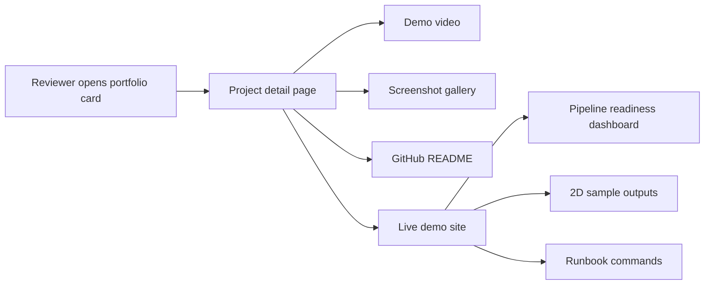
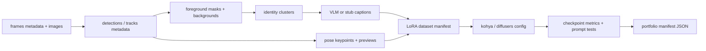
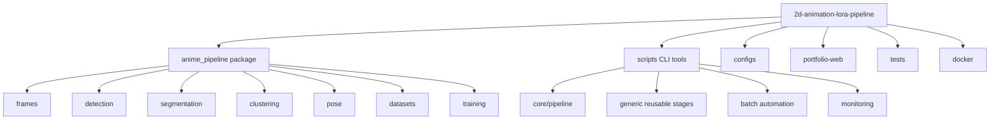
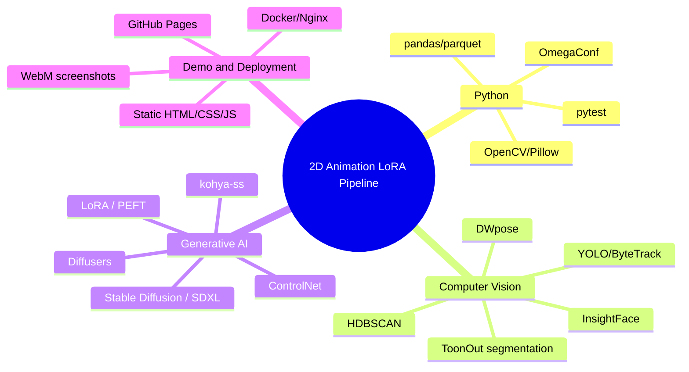
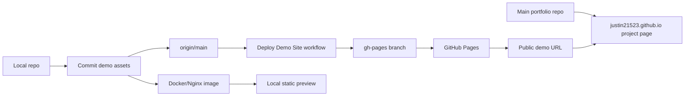

# 2D Animation LoRA Pipeline

Portfolio-ready data engineering and training pipeline for 2D animation character LoRA datasets. The project turns animation footage into staged artifacts: frames, multi-character detections, track-aware foreground masks, identity clusters, pose conditioning records, captioned LoRA datasets, training configs, checkpoint metrics, and a public mock-safe demo layer that can be reviewed without private media or model weights.

The repository is intentionally file-driven. There is no production database or hosted inference API. YAML/TOML configs, parquet/JSON metadata, image artifacts, and static manifests are the contracts between stages.

## Demo Links

| Asset | URL / Path | Purpose |
| --- | --- | --- |
| Public demo site | https://justin21523.github.io/2d-animation-lora-pipeline/ | Static product-style demo for interview review |
| Portfolio case study | https://justin21523.github.io/zh-TW/projects/2d-animation-lora-pipeline/ | Main portfolio page with screenshots, recording, and links |
| Local static site | `portfolio-web/index.html` | Source for the published demo |
| Demo manifest | `portfolio-web/demo-data/manifest.json` | Frontend data contract for stages, scenarios, metrics, and media |
| Demo screenshots | `portfolio-web/assets/screenshots/` | Review-ready screenshot assets |
| Demo video | `portfolio-web/assets/video/demo-walkthrough.webm` | Short walkthrough recording |

## Quick Reviewer Path

```bash
pip install -r requirements/core.txt -r requirements/dev.txt
python scripts/demo/run_demo_pipeline.py --skip-pipeline
python -m pytest tests/demo tests/test_end_to_end_pipeline.py -q
python -m http.server 8080 -d portfolio-web
```

Open `http://localhost:8080`.

For the focused CPU-safe smoke suite:

```bash
./tests/run_tests.sh
```

## What This Project Demonstrates

| Area | What is shown | Why it matters in an interview |
| --- | --- | --- |
| ML data engineering | Stage outputs are tracked as files and metadata | Shows reproducible data contracts, not only model prompting |
| Computer vision pipeline | YOLO tracking, ToonOut-style masks, identity clustering, pose data | Shows multi-stage CV orchestration for difficult 2D animation footage |
| Training readiness | Captioned LoRA datasets, kohya/diffusers configs, checkpoint metrics | Shows awareness of real training constraints and evaluation loops |
| Demo safety | CPU-safe synthetic assets and stub workflows | Lets reviewers run it without private media, GPUs, secrets, or model downloads |
| Product presentation | Static site, screenshots, video, portfolio integration | Makes the work understandable in a few minutes |
| Deployment | GitHub Pages and Docker/Nginx static hosting | Shows practical release packaging |

## Product Demo Flow



The first screen of the demo shows the product itself: stage readiness, metrics, a synthetic character dataset sheet, and result artifacts. It is not just a marketing landing page.

## System Architecture

```mermaid
flowchart TB
    subgraph Inputs
        V[2D animation footage]
        C[Project and stage YAML configs]
        M[Local model warehouse]
    end

    subgraph Core[Python pipeline core]
        O[Pipeline orchestrator]
        S[Stage manager]
        R[Resource monitor]
        IO[Metadata and artifact IO]
    end

    subgraph Vision[Computer vision stages]
        F[Frame extraction]
        Y[YOLO + ByteTrack tracking]
        T[ToonOut-style segmentation]
        P[DWpose conditioning]
        H[Face embedding identity clustering]
    end

    subgraph Training[Dataset and training stages]
        D[Captioned dataset builder]
        K[kohya / diffusers LoRA training]
        Q[Checkpoint evaluation and prompt tests]
    end

    subgraph Demo[Public demo layer]
        Stub[CPU-safe synthetic artifacts]
        Manifest[Static manifest JSON]
        Site[portfolio-web static site]
        Media[Screenshots and WebM video]
    end

    V --> F
    C --> O
    M --> Y
    O --> S
    O --> R
    S --> IO
    F --> Y --> T --> H --> D --> K --> Q
    Y --> P --> D
    IO --> Manifest
    Stub --> Manifest
    Manifest --> Site
    Media --> Site
```



## Data Flow



## Pipeline Stage Matrix

| Order | Stage | Output contract | Demo-safe? | Real workflow dependency |
| --- | --- | --- | --- | --- |
| 1 | Frame extraction | Frame images and scene metadata | Yes | Video decoder, scene detection |
| 2 | YOLO + ByteTrack | Detection boxes, track IDs, per-frame metadata | Yes | YOLO weights for real data |
| 3 | ToonOut segmentation | RGBA foreground cutouts and background references | Yes | ToonOut/ONNX/PyTorch model for real data |
| 4 | DWpose extraction | Pose keypoints and visual previews | Yes | DWPose runtime for real data |
| 5 | Identity clustering | Track-to-character groups and face crops | Yes | InsightFace/HDBSCAN for real data |
| 6 | Dataset building | Captioned LoRA-ready rows | Yes | VLM/OpenAI captioning optional |
| 7 | LoRA training | Training config, checkpoint metrics, sample prompts | Yes | CUDA, base model, kohya/diffusers stack |

## Module Organization



## Tech Stack Map



## Frontend, Backend, Data, API, Deployment

| Layer | Implementation | Current status |
| --- | --- | --- |
| Frontend | Static HTML/CSS/JS in `portfolio-web/` | Works locally and on GitHub Pages |
| Backend | Python CLI and file-based pipeline stages | No persistent service; demo-safe CLI works |
| Database | None | Parquet/JSON files are the data contracts |
| Public API | None | Browser fetches static `demo-data/manifest.json` |
| Real ML runtime | Local GPU workstation workflow | Requires model/data warehouse and compatible CUDA stack |
| Demo runtime | CPU-safe synthetic assets | Works without private data, GPU, external APIs, or model weights |
| Deployment | GitHub Pages via `gh-pages`, plus Docker/Nginx | Static demo is deployable and verifiable with HTTP checks |

## Demo Scenarios

| Scenario | What to show | Time |
| --- | --- | --- |
| Fast portfolio review | Open portfolio page, play demo video, inspect gallery | 1-2 minutes |
| Product demo | Open public demo site, scroll Results -> Pipeline -> Media | 3-5 minutes |
| Engineering review | Run the manifest generator and demo tests locally | 5 minutes |
| Architecture review | Walk through README diagrams and stage matrix | 5-10 minutes |
| Deployment review | Show GitHub Pages workflow and Docker image build | 3 minutes |

## Local Demo Commands

Install demo-safe dependencies:

```bash
pip install -r requirements/core.txt -r requirements/dev.txt
```

Regenerate the public demo manifest and media:

```bash
python scripts/demo/run_demo_pipeline.py --skip-pipeline
```

Serve the static demo:

```bash
python -m http.server 8080 -d portfolio-web
```

Build and serve through Docker:

```bash
docker build -f docker/portfolio.Dockerfile -t 2d-animation-lora-pipeline-demo .
docker run --rm -p 8080:80 2d-animation-lora-pipeline-demo
```

## Testing and Verification

| Check | Command | Expected result |
| --- | --- | --- |
| Demo manifest and assets | `python -m pytest tests/demo -q` | Demo assets exist and manifest is valid |
| Stub E2E tests | `python -m pytest tests/test_end_to_end_pipeline.py -q` | Captioning + CV stub workflow passes |
| Resource/stage manager tests | `python -m pytest tests/core/pipeline/test_resource_monitor.py tests/core/pipeline/test_stage_manager.py -q` | CPU-safe core tests pass |
| Focused smoke suite | `./tests/run_tests.sh` | Stable demo-safe suite passes |
| Static HTTP check | `curl -I http://localhost:8080/demo-data/manifest.json` | `200 OK` |
| Docker static build | `docker build -f docker/portfolio.Dockerfile -t 2d-animation-lora-pipeline-demo .` | Nginx image builds |
| Pipeline config dry-run | `python scripts/run_pipeline.py --project portfolio_demo_2d --mode 2d --device cpu --dry-run` | Stage summary renders without stale stage errors |

Full `python -m pytest tests/` can require GPU/model dependency alignment because several tests touch heavy diffusers, inpainting, training, or local model paths.

## Real Model Workflow

Real model runs are workstation jobs, not hosted website jobs.

```bash
pip install -r requirements/all.txt
bash scripts/setup/install_pipeline_dependencies.sh
python scripts/run_pipeline.py --project <project_id> --mode 2d --device cuda --dry-run
python scripts/run_pipeline.py --project <project_id> --mode 2d --device cuda
```

Common requirements:

| Requirement | Why it is needed |
| --- | --- |
| CUDA-capable GPU | Real segmentation, embeddings, diffusion inference, and LoRA training |
| Local model warehouse | Avoids committing model weights |
| Dataset warehouse | Stores raw media and generated artifacts outside git |
| Optional API keys | Only for API-based captioning/refinement workflows |
| Optional ComfyUI/kohya env | Visual workflow comparison and training launchers |

## Deployment Architecture



The ML pipeline does not run on GitHub Pages. Pages only hosts `portfolio-web/`, static screenshots, demo video, and the generated manifest.

## Current Status

| Area | Status | Evidence |
| --- | --- | --- |
| Demo-safe site | Working | `python -m http.server 8080 -d portfolio-web` |
| Demo asset generation | Working | `python scripts/demo/run_demo_pipeline.py --skip-pipeline` |
| Demo tests | Working | `python -m pytest tests/demo -q` |
| Stub E2E smoke | Working | `python -m pytest tests/test_end_to_end_pipeline.py -q` |
| Static deployment | Ready | `.github/workflows/deploy-demo-pages.yml` and Dockerfile |
| Portfolio integration | Supported | Main portfolio slug is `2d-animation-lora-pipeline` |
| Real GPU training | Environment-dependent | Requires local model/data warehouse and CUDA stack |
| Hosted backend/API | Not applicable | Public demo is intentionally static |

## Known Risks and Limits

| Risk | Impact | Mitigation |
| --- | --- | --- |
| Real model workflows depend on local GPU and model paths | Cannot be fully reproduced on CPU-only machines | Public demo uses deterministic mock-safe artifacts |
| Large generated media/checkpoints are intentionally untracked | Reviewers cannot inspect private raw training data | README and demo show anonymized stage outputs |
| Some scripts are research/batch oriented | Full repo contains more tools than the interview path needs | Demo-safe commands and docs define the stable path |
| Optional API captioning needs secrets | Public CI cannot call external captioning APIs | API paths are not required for demo-safe tests |
| GitHub Pages is static only | Cannot run real ML inference in browser | Real pipeline remains CLI/workstation; static demo shows results |

## Interview Highlights

Reviewers should focus on:

- File-based ML data contracts through parquet/JSON manifests.
- Config-driven orchestration rather than hard-coded one-off scripts.
- 2D-specific handling: hard-edge masks, multi-character frames, style drift, and identity merging.
- Clear separation between real GPU workflows and CPU-safe public demo mode.
- Public demo assets that are safe to screenshot, record, and publish.
- Main portfolio integration with cover, gallery, video, demo link, GitHub, and README.

## Privacy and Data Notes

Raw media, model weights, generated datasets, checkpoints, logs, and secrets are intentionally excluded from git. Public assets in `portfolio-web/` are synthetic/anonymized demonstration files intended for portfolio review.
